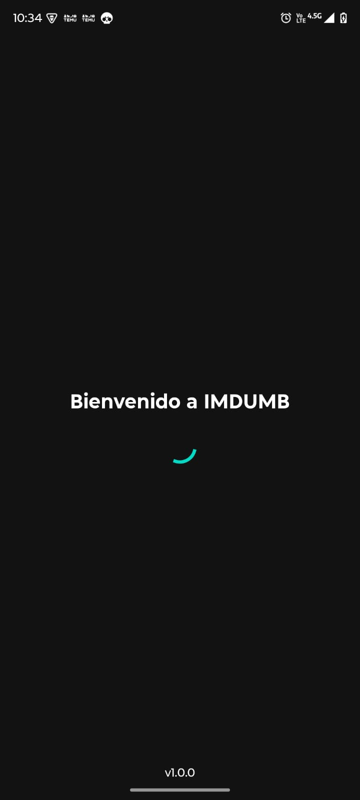
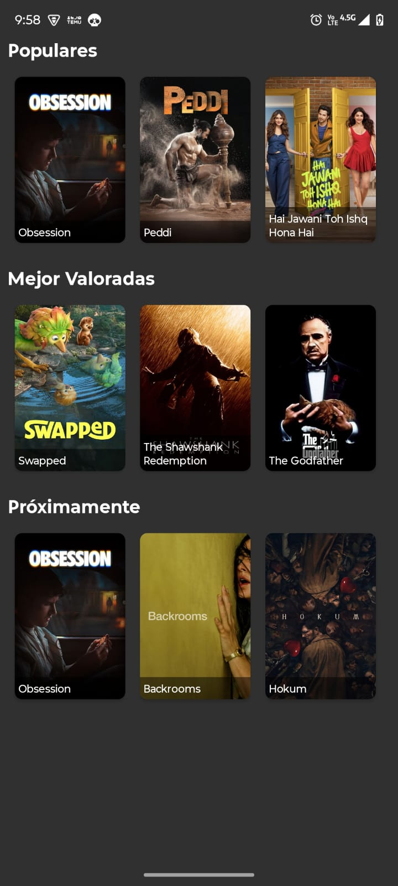
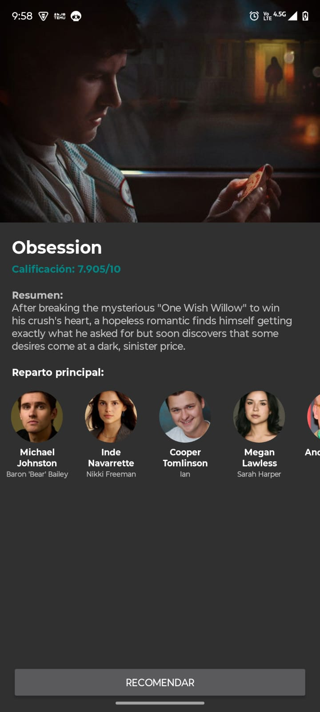
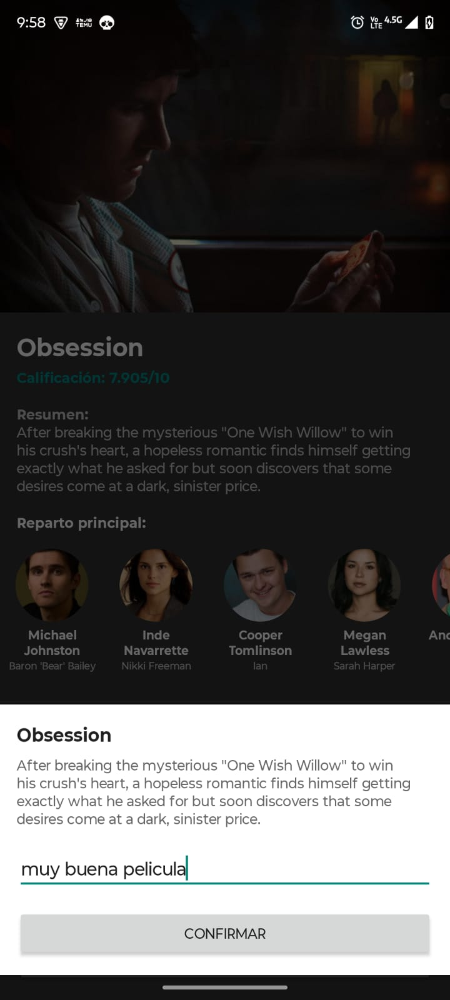

# IMDUMB - Technical Challenge

## Resumen del Proyecto
IMDUMB es una aplicación Android que consume la API de TheMovieDB para mostrar categorías de películas y detalles técnicos de cada una, incluyendo reparto principal y carrusel de imágenes. El proyecto está diseñado siguiendo estándares de la industria para aplicaciones escalables, mantenibles y reactivas.

## Arquitectura
Se ha implementado **MVP (Model-View-Presenter)** junto con **Clean Architecture**, dividiendo el proyecto en capas de responsabilidad:

### Capas:
- **Data**: Implementación de la lógica de datos. Incluye:
  - **Remote**: Consumo de API REST con Retrofit.
  - **Repository Impl**: Implementación de las interfaces definidas en Domain.
  - **Mappers**: Conversión de DTOs a modelos de Dominio.
- **Domain**: Lógica de negocio pura. Contiene:
  - **Models**: Entidades de negocio (POJOs de Kotlin).
  - **Repository Interfaces**: Contratos para la capa de datos.
  - **Use Cases**: Casos de uso específicos (e.g., `GetMoviesByCategoriesUseCase`).
- **Presentation**: UI y lógica de vista.
  - **MVP**: Los Presenters manejan el flujo de datos usando RxJava y notifican a las Views (Activities/Fragments).
  - **UI**: Layouts XML con ViewBinding.

## Tech Stack y Dependencias
- **Lenguaje**: Kotlin `2.0.21`
- **Inyección de Dependencias**: Hilt `2.55`
- **Networking**: Retrofit `2.11.0` + Gson `2.12.1`
- **Programación Reactiva**: RxJava 2 `2.2.21` + RxKotlin `2.4.0` + RxAndroid `2.1.1`
- **Imagen**: Glide `4.16.0` (Carga de posters y perfiles de actores)
- **Firebase**: 
  - Remote Config (Splash dinámico, Feature Toggles de recomendación y Temas).
  - Firebase BoM `33.10.0`
- **UI Components**:
  - ConstraintLayout `2.2.1`
  - RecyclerView `1.4.0`
  - ViewPager2 `1.1.0` (Carrusel de imágenes en detalle)
  - BottomSheetDialogFragment (Formulario de recomendación)

## Versiones de Entorno
- **Android Studio**: Ladybug o superior.
- **Gradle**: `9.4.1`
- **Android Gradle Plugin (AGP)**: `8.7.2`
- **Minimum SDK**: `24`
- **Target SDK**: `35`

## Configuración de Firebase
El proyecto requiere el archivo `google-services.json` en la carpeta `app/`. Se utilizan los siguientes parámetros en **Remote Config**:
- `welcome_text`: Mensaje en el Splash.
- `home_title`: Título dinámico del Home.
- `enable_recommendation`: Feature toggle (Boolean) para el botón de recomendar.
- `app_theme`: Control de tema (`light` / `dark`).

## Endpoints Utilizados (TheMovieDB)
- `GET /movie/popular`: Obtiene películas populares.
- `GET /movie/top_rated`: Obtiene películas mejor valoradas.
- `GET /movie/upcoming`: Obtiene próximos estrenos.
- `GET /movie/{movie_id}/credits`: Obtiene el reparto principal (Actores).
- **Imágenes**: `https://image.tmdb.org/t/p/w500`

## Principios SOLID Documentados
- **S (SRP)**: Mappers (`MovieMapper.kt`) solo transforman datos; UseCases solo ejecutan una acción.
- **O (Open/Closed)**: Repositorios escalables mediante interfaces.
- **L (Liskov)**: Las implementaciones de repositorios en `Data` son intercambiables mediante Hilt.
- **I (Interface Segregation)**: Contratos MVP específicos por pantalla (`MainContract`, `DetailContract`).
- **D (Dependency Inversion)**: Hilt inyecta abstracciones en los Presenters y Activities.

## Cómo ejecutar el proyecto
1. Clonar el repositorio.
2. Abrir en Android Studio.
3. Asegurar que las claves están en `gradle.properties` (incluidas por defecto para este reto).
4. Realizar un **Gradle Sync**.
5. Seleccionar el Build Variant `devDebug` o `prodRelease`.
6. Ejecutar en un dispositivo real o emulador.

## Capturas de Pantalla

|           Splash Screen           |       Home (Categorías)       |        Detalle de Película        | Recomendación |
|:---------------------------------:|:-----------------------------:|:---------------------------------:|:---:|
|  |  |  |  |

